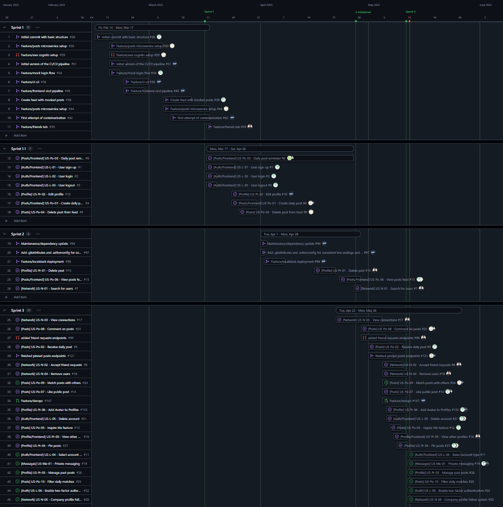

# Project Organization

> **Repository:** `project_organization`
>
> This README explains **how we planned, tracked and delivered** the DailyGrind application as required by the *Project‑submission* specification. It complements the service‑level READMEs (e.g. `user-service/README.md`) by focusing on **process, timeline and collaboration practices** rather than implementation details.

---

## 1  Process & Methodology

| Aspect                 | Choice                                                                                                | Motivation                                                                                                                                     |
| ---------------------- |-------------------------------------------------------------------------------------------------------|------------------------------------------------------------------------------------------------------------------------------------------------|
| **Framework**          | *Scrum* (adapted)• sprints according to deliverables• Sprint Planning, Weekly Meetings, Review, Retro | Lightweight ceremonies gave structure without slowing a 5‑person team.Regular inspect‑and‑adapt loops aligned well with the semester calendar. |
| **Backlog tool**       | [*GitHub Projects*](https://github.com/orgs/ase-fs25/projects/1/views/1?visibleFields=%5B%22Title%22%2C%22Assignees%22%2C%22Status%22%2C%22Labels%22%2C171941015%2C171941277%2C%22Milestone%22%2C%22Type%22%2C191634090%2C191634109%5D)                                                                                 | Seamless integration with Issues, PRs and road‑mapping → one single source of truth.                                                           |
| **Task tracking**      | Issues → Tracked during weekly meetings and solve them on the respective Github ticket                | Ensures every code change has a traceable discussion & acceptance criteria.                                                                    |
| **Definition of Done** | • Code & unit tests pass locally• CI pipeline green• PR approved by ≥1 peer• Docs updated             | Keeps quality bar explicit and shared.                                                                                                         |

### Sprint cadence

| Sprint | Dates (2025)        | Theme                                         |
| ------ |---------------------|-----------------------------------------------|
| 1      | **Jan 29 – Mar 17** | Project setup, CI, core user flows            |
| 2      | **Mar 18 – Mar 31** | CRUD for users, first batch of functionality  |
| 3      | **Apr 01 – Apr 28** | Second batch of functionality, CRUD for posts |
| 4      | **Apr 29 – May 12** | Final batch of functionality, testing, polish |

*(Exact tasks per sprint are visualised in the roadmap below.)*


## 2  Timeline / Road‑map

> The Gantt‑style view was exported from GitHub Projects on **2025‑05‑25**. Milestones (green) mark sprint boundaries; red verticals highlight release candidates.



Key observations:

* Parallel swim‑lanes show each micro‑service being developed in isolation yet aligned via the sprint cadence.
* White dots = completed tasks; hollow = in‑progress → burn‑down used for velocity tracking.

---

## 3  Version‑control Strategy

We employed a **trunk‑based flow with short‑lived feature branches**:

```
main            ← production
│
└─ develop      ← integration branch, auto‑deploys to staging
   ├─ feature/ | one branch per Issue (lifetime ≤ 7 days)
   ├─ release/ | one branch per Sprint
   └─ fix/ | emergency patch branched from develop
```

* **Conventions** enforced by branch protection rules & CI checks.
* Automatic **squash‑and‑merge** keeps history linear and readable.
* Final Tag freezes the tree for deliverables as requested in the *Project‑submission* PDF.

---

## 4  Pull‑request Workflow

1. **Draft PR** opened as soon as coding starts; linked to its Issue.
2. Status checks:   • lint & unit & integration tests   • Docker image build   • SonarQube (Code Analysis)
3. At least **one reviewer** outside the author’s sub‑team required.
4. On *Approve* → squash‑merge → auto‑close Issue → Project card moves to *Done*.

---

## 5  Continuous Integration & Quality Gates

| Stage                | Tool                                        | Purpose                                                |
| -------------------- |---------------------------------------------|--------------------------------------------------------|
| **Build**            | GitHub Actions `mvn test` / `npm test`      | Unit & integration tests                               |
| **Lint**             | ESLint, Prettier                            | Style & import‑order consistency                       |
| **Containerise**     | Docker build & push to GHCR                 | Ensures image reproducibility                          |
| **IaC validate**     | `terraform fmt` + `terraform validate`      | Prevents drift & syntax errors                         |
| **Deploy (preview)** | `docker‑compose up` on ephemeral EC2 runner | Integration tests running in separate Localstack container |
| **Security**         | Dependabot scan                             | Early detection of CVEs                                |

Pipelines must be green before PR merge; `main`/`develop` are both protected.

---

## 6  Documentation Index

* **Service READMEs** – see `/microservices/README.md`:   [User Service](../microservices/user-service/README.md), [Post Service](../microservices/post-service/README.md), [PushNotificationService Service](../microservices/push-notification-service/README.md).
* **Java docs** – accessible for each microservice at (`*/docs/index.html`).
* **API docs** – Swagger UIs exposed at each service (`/swagger-ui/index.html`).


---

## 7  How to Reproduce the Board

You can access teh Github Project Board [here](https://github.com/orgs/ase-fs25/projects/1/views/6?groupedBy%5BcolumnId%5D=Milestone&visibleFields=%5B%22Title%22%2C%22Assignees%22%2C%22Status%22%2C191634090%2C191634109%2C%22Milestone%22%5D&sortedBy%5Bdirection%5D=asc&sortedBy%5BcolumnId%5D=Milestone&sortedBy%5Bdirection%5D=asc&sortedBy%5BcolumnId%5D=191634090)

---

## 8  Submission Artifacts

| Item                 | Location                                                       |
| -------------------- |----------------------------------------------------------------|
| Source code snapshot | `releases/DailyGrind_submission.zip` (tag `v1.0.0-submission`) |
| Board screenshot     | `img/Github_Project_Roadmap.jpeg` (shown above)                |
| Version graph        | `docs/git-graph.png` (generated via `git log --graph`)         |
| This README          | `project_organization/README.md`                               |

---

### A  Motivation Recap

All tooling choices (GitHub Projects, Actions, GHCR) keep **code, issues, CI/CD and docs under one GitHub umbrella**, reducing context‑switching and onboarding time while staying free for student use.

---

© 2025 DailyGrind Team – Advanced Software Engineering
