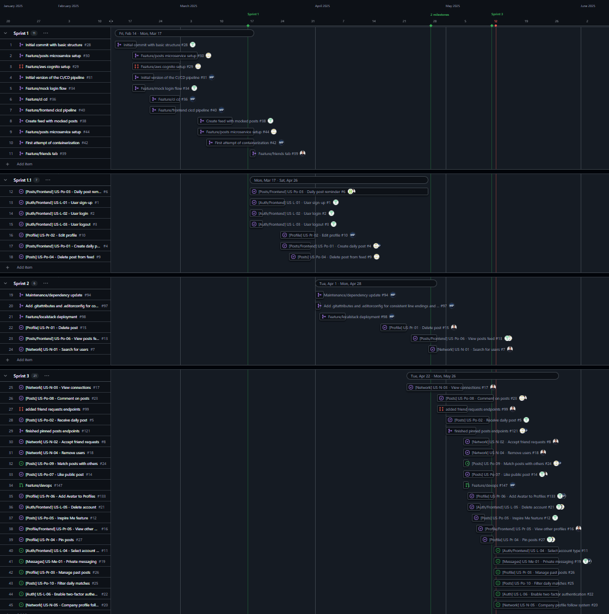

# DailyGrind
[](https://sonarcloud.io/summary/new_code?id=ase-fs25_DailyGrind)

## Project Organization

This section explains how the team planned, tracked, and delivered the DailyGrind application, focusing on process, timeline, collaboration practices, and final deliverables.

---

### Team Members and Their Main Focuses

- **Jonas Gebel** – Lead Frontend Developer  
- **Leonard Wagner** – Lead Backend Developer & DevOps  
- **Mete Polat** – DevOps Engineer  
- **Tim Vorburger** – Full-Stack Developer  
- **Toni Krstic** – Full-Stack Developer  

---

### Process & Methodology

| Aspect                 | Choice                                                                                          | Motivation                                                                                                                             |
|------------------------|--------------------------------------------------------------------------------------------------|----------------------------------------------------------------------------------------------------------------------------------------|
| **Framework**          | Scrum (adapted): 4 sprints, weekly meetings, review & retro                                     | Lightweight process that fit the semester timeline. Weekly inspect-and-adapt loops improved delivery consistency.                     |
| **Backlog Tool**       | [GitHub Projects](https://github.com/orgs/ase-fs25/projects/1/views/1)                          | Tight integration with issues, PRs, milestones — one source of truth for planning and tracking.                                       |
| **Task Tracking**      | GitHub Issues tracked during weekly meetings                                                    | Ensures traceability, structured progress, and clarity on ownership.                                                                  |
| **Definition of Done** | Code + tests pass locally, CI pipeline green, PR reviewed and approved, documentation updated   | Maintains shared quality expectations across services and contributors.                                                               |

---

### Sprint Cadence

| Sprint | Dates (2025)        | Theme                                         |
|--------|---------------------|-----------------------------------------------|
| 1      | Jan 29 – Mar 17     | Project setup, CI, core user flows            |
| 2      | Mar 18 – Mar 31     | CRUD for users, first batch of functionality  |
| 3      | Apr 01 – Apr 28     | Second batch of functionality, CRUD for posts |
| 4      | Apr 29 – May 12     | Final batch of functionality, testing, polish |

*All sprint tasks were tracked and visualized in the roadmap below.*

---

### Timeline / Roadmap

> The roadmap was exported from GitHub Projects on May 25, 2025.



Key observations:

- Parallel swim-lanes show each microservice progressing independently, yet synchronized by sprint.
- White dots = completed tasks; hollow = in progress.
- Burndown trends helped track velocity.

---

### Version Control Strategy

We used a **trunk-based development model** with short-lived branches:
```
main            ← production
│
└─ develop      ← integration branch, auto‑deploys to staging
   ├─ feature/ | one branch per Issue (lifetime ≤ 7 days)
   ├─ release/ | one branch per Sprint
   └─ fix/ | emergency patch branched from develop
```

- All branches followed naming conventions and protection rules.
- **Squash-and-merge** was enforced to keep history linear.
- Each sprint was tagged at release (e.g., `v1.0.0-submission`).

---

### Pull Request Workflow

1. **Draft PR** opened when work begins; always linked to its GitHub Issue.
2. PR runs checks:
   - Lint, unit & integration tests
   - Docker build
   - SonarQube static code analysis
3. At least **one peer review** required (cross-team if possible).
4. Upon approval → **squash-merge**, auto-close Issue, move to *Done* in project board.

---

### Submission Artifacts

| Item                  | Location                                                       |
|-----------------------|----------------------------------------------------------------|
| Source code snapshot  | `releases/DailyGrind_submission.zip` (tag `v1.0.0-submission`) |
| Project board export  | `img/Github_Project_Roadmap.jpeg`                              |
| Git version graph     | `docs/git-graph.png`                                           |
| This documentation    | Root `README.md`, section: Project Organization                |

---

### Motivation Recap

All tooling was intentionally selected to keep **code, issues, CI/CD, planning, and documentation within GitHub**. This reduced context-switching, sped up onboarding, and ensured a free, student-friendly setup while simulating real-world DevOps workflows.


## Documentation

## How to run the project

## Testing and continuous integration
