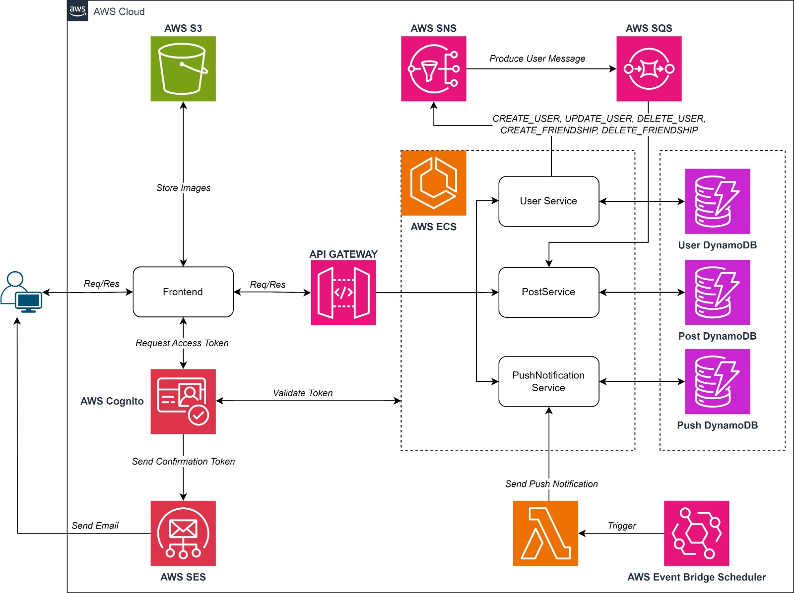
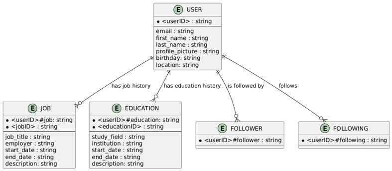
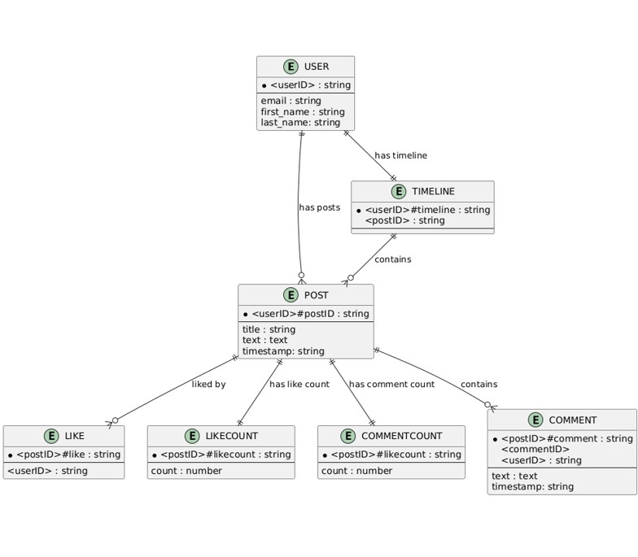
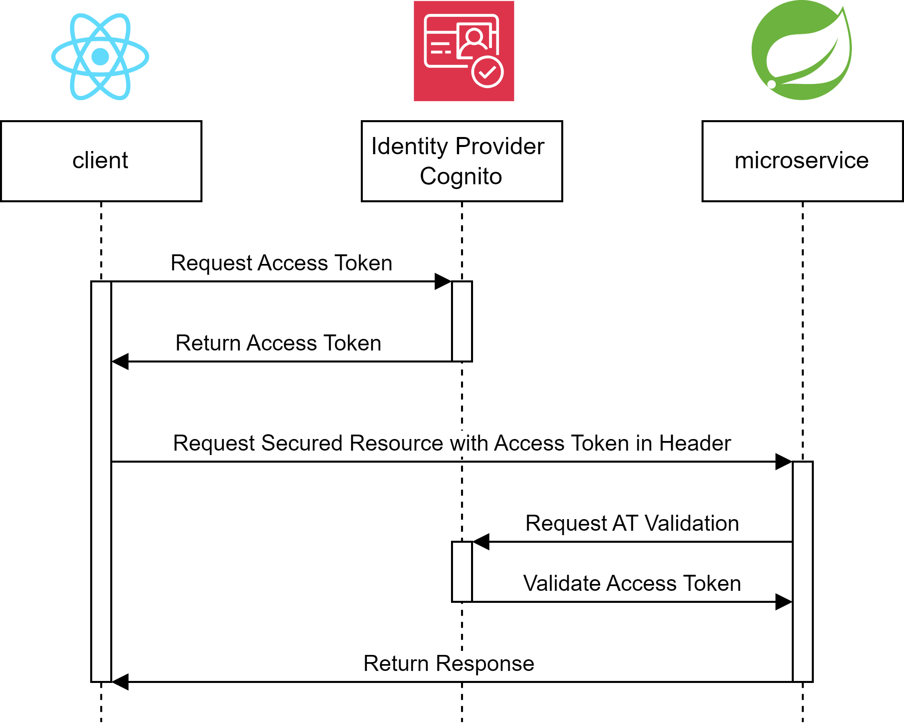

# Architecture Overview

## Microservices

Each microservice has its own detailed documentation explaining service-specific functionality as well as motivations for technologies used:

- [Post Service](../microservices/post-service/README.md) - Manages posts, comments, likes, and timelines
- [User Service](../microservices/user-service/README.md) - Handles user profiles and friendship relationships
- [Push Notification Service](../microservices/push-notification-service/README.md) - Delivers web push notifications

User Service and Post Service are decoupled and communicate via AWS SNS and SQS. The Post Service consumes events from the User Service to ensure that posts in the timeline and comments always have the most recent user data. The Push Notification Service is responsible for sending web push notifications to users. By separating these services, we can ensure that each service is responsible for a specific task and can be developed and deployed independently. This allows for easier maintenance and scaling of the application.

## AWS Infrastructure Components

### Storage & Database

- **DynamoDB**:  single-table design per micro-service \
  (see AWS [best practices for social networks](https://docs.aws.amazon.com/amazondynamodb/latest/developerguide/data-modeling-schema-social-network.html)):
  - **User table** – profiles, credentials, and relationship data
  - **Post table** – posts, comments, likes, timeline entries
  - **Push Subscription Table** - Subscription objects for *Web Push* notifications

<strong>Show DynamoDB Data Model for User Service </strong>

  

<strong>Show DynamoDB Data Model for Post Service </strong>

  

### Messaging & Communication
- **SNS Topics**: Event publishing for inter-service communication
- **SQS Queues**: Asynchronous message processing
  - FIFO queues for ordered event processing
  - Standard queues for high-throughput scenarios

### Identity & Access Management
- **Cognito**: User pools and identity providers
  - JWT token generation and validation
  - OAuth2 authentication flow

<strong>Show Authentication Flow </strong>

  

### Event Processing
- **EventBridge**: Configuration for scheduled events
- **Lambda**: Event-triggered functions for push notifications

### Containerized Services
- **ECS**: Container orchestration plattform
  - Dedicated 'dailygrind-cluster' for all microservices
  - FARGATE launch type for serverless container management
  - Scalable desired count (currently set to 1 for each service)
  - Container port mappings for service discovery

### Static Content & Frontend Deployment
- **S3**: Storage buckets for:
  - Media assets and user-uploaded files
  - Frontend application deployment (React/TypeScript bundle)
  - Static website hosting with website configuration
  - CloudFront distribution origin

- ### REST APIs
- **API Gateway**: Central entry point for all microservices (Infrastructure is ready but currently not fully supported through localstack)
  - Unified endpoint management with authentication integration
  - Request validation and transformation
  - Rate limiting and throttling controls
  - CORS configuration for browser security
  - Integration with Cognito for JWT validation
